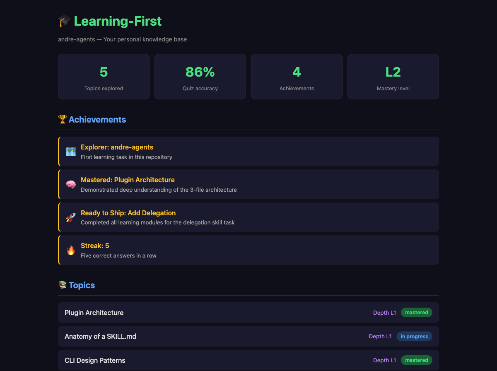

# Learning-First 🎓

**Your AI pair programmer becomes your AI mentor — with a live visual dashboard.**

A plugin for [GitHub Copilot CLI](https://docs.github.com/copilot/how-tos/copilot-cli) and
[Claude Code](https://docs.anthropic.com/en/docs/claude-code) that transforms your coding
agent from "I'll build it for you" into "Let me help you understand it so you can build it yourself."

> *"The best AI assistant isn't the one that writes the most code — it's the one that makes you need it less."*



### ✨ Visual First

The dashboard at `http://localhost:3142` **auto-starts** with every session — your learning
progress, quiz performance, spaced repetition schedule, and achievements update live via SSE
as you work in the CLI. No manual server management needed.

---

## What It Feels Like

### First time in a new repo

```
You:  Add JWT authentication to the API

Agent: 👋 Welcome! This is your first time in payments-api with learning-first.
       Would you like learning mode active for this repository?
       - Yes — I'll teach concepts before you implement (recommended)
       - No — I'll work normally

You:  Yes

Agent: I'm using learning-first to teach the relevant concepts before we implement.

       To build JWT auth well, you'll need to understand 4 things about this codebase:

       📚 Learning Path:
       1. How the existing auth layer works (this codebase)
       2. JWT fundamentals (tokens, claims, signatures)
       3. Express middleware patterns
       4. Security considerations

       Some of these may be familiar — we'll adjust as we go. Ready?
```

### The teaching flow

```
Agent: Let me show you how auth currently works here.

       📄 src/middleware/auth.ts (lines 12-28)
       [shows actual code from the codebase]

       What do you notice about how this middleware handles the request?

You:  It checks for a session cookie and validates it against the database

Agent: Exactly. Now — JWT would replace that database lookup. Why might that
       be useful? What trade-off are you making?

You:  It's faster because you don't hit the DB, but you can't revoke tokens easily

Agent: 🎯 That's the core trade-off. You just identified the #1 design decision
       you'll need to make for this feature.

       Quick check — which part of a JWT contains the user's data?
       A) Header
       B) Payload
       C) Signature
       D) All three

You:  B

Agent: ✅ Right — the payload carries claims. The header says "how it's signed"
       and the signature proves it wasn't tampered with.
```

### When you're stuck (graduated help)

```
Agent: Looking at the existing middleware, how would you modify it to
       validate a JWT instead of a session cookie?

You:  ...I'm not sure where to start

Agent: That's okay — think about it for a moment.
       What does the current middleware receive as input?        ← Level 0: encourage

You:  The request object with headers

Agent: Good. And where would a JWT typically be in those headers?  ← Level 1: reframe

You:  The Authorization header?

Agent: Exactly. So what would your first line of code do?          ← Level 2: hint

You:  Extract the token from the Authorization header

Agent: 🎯 Now you're rolling. The pattern is:
       `const token = req.headers.authorization?.split(' ')[1]`
       What would you do with it next?
```

### When you know your stuff (progressive assistance)

As you demonstrate mastery, the agent gives you more runway:

```
Agent: Based on your quiz results (92% accuracy, 8 topics mastered in this repo),
       you're at Level 3. I'll provide scaffolding — you fill in the logic.

       Here's the middleware structure:

       // src/middleware/jwt-auth.ts
       // TODO: Extract token from Authorization header
       // TODO: Verify token with secret
       // TODO: Attach decoded payload to req.user
       // TODO: Handle expired/invalid tokens

       I've also set up a failing test:

       // tests/jwt-auth.test.ts
       test('rejects request when token is expired', async () => {
         // TODO: Your assertion here
       });

       Go for it — I'll review when you're ready.
```

### When you want to skip

```
You:  I know JWT well, skip

Agent: Got it — skipping JWT module. Moving to Express middleware patterns.
       [no guilt, no pushback, recorded for next time]
```

### When you want to override

```
You:  I'm under deadline pressure, just build it

Agent: Got it — switching to implementation mode.
       Would you like me to:
       - Use a structured workflow (brainstorming → planning → TDD)
       - Just implement directly

       I'll prepare a catch-up curriculum for next time. 📝

       [next session]
Agent: Welcome back! Last time you used override for JWT auth.
       Want a quick catch-up on the concepts? (Just say 'catch up' anytime)
```

---

## Achievements 🏆

Achievements are earned through demonstrated understanding — not participation trophies.
They're personalized to what you actually learned.

| Achievement | How You Earn It | Example |
|-------------|----------------|---------|
| 🗺️ **Explorer: {repo}** | First learning task in a new repo | *"Explorer: payments-api — first task and you already spotted the idempotency pattern."* |
| 🧠 **Mastered: {topic}** | Streak ≥3 + transfer quiz + 7-day retention | *"Mastered: JWT Auth — you explained the refresh token race condition without any hints."* |
| 🚀 **Ready to Ship: {task}** | Completed all modules for a task | *"Ready to Ship: Add Auth — you proposed a clean middleware design with proper error handling."* |
| 📈 **Deepening: {topic}** | Returned and went deeper (L1→L2→L3) | *"Deepening: Database Layer (L1→L2) — last time basics, this time you understood the connection pool sizing."* |
| 🔄 **Retained: {topic}** | Passed a spaced review after ≥7 days | *"Retained: Express Middleware — still solid after two weeks. That's real knowledge."* |
| 🔥 **Streak: {count}** | Multiple correct answers in a row | *"Streak: 10 — you're on fire today."* |
| 🎓 **Mentor Ready: {area}** | Expert-level across an entire domain | *"Mentor Ready: Authentication — you could teach this to someone else."* |

---

## How Learning Adapts

### Per-repository knowledge

Each repo tracks your knowledge separately. Expert in `payments-api` auth doesn't mean
you skip auth teaching in `user-service` — different codebase, different patterns.

### Progressive trust

| Your Level | What You Get | How It's Measured |
|-----------|-------------|-------------------|
| **Beginner** | Pure teaching — questions, existing code examples, concepts | Few topics, <60% quiz accuracy |
| **Intermediate** | Teaching + placeholder comments + failing test skeletons | Some mastered topics, 60-85% accuracy |
| **Expert** | Teaching + scaffolding — you fill in the logic | Many mastered topics, >85% accuracy |

### Spaced repetition (SM-2)

Topics you've learned come back for review at scientifically-optimized intervals:
`1 day → 3 days → 7 days → 16 days → 35 days → 90 days`

Failed a review? The interval resets — but you get a refresher, not a full re-teach.

### Fatigue detection

After ~25 minutes of active learning or when your quiz response times slow down,
the agent suggests a break. Learning science says pushing through fatigue wastes time.

### Metacognition

After each quiz, the agent asks "How confident are you? (1-5)". This surfaces
over-confidence and under-confidence — both valuable signals for the curriculum.

---

## Real Mastery (Not Just Streaks)

Getting 3 answers right in a row doesn't mean you've mastered a topic.
Learning-first requires **all three**:

1. ✅ **Correct streak ≥3** at depth level 2 or higher
2. ✅ **Transfer quiz passed** — can you apply the concept to a *novel* problem?
3. ✅ **7-day retention** — do you still know it a week later?

Only then does the topic earn "mastered" status and unlock higher assistance levels.

## Installation

Learning-first installs **alongside** your existing project — it doesn't modify your
files, add dependencies, or change your build. It's a plugin that lives outside your
codebase and only activates when the AI agent starts a session.

### Prerequisites

- **Node.js** ≥ 22 (uses built-in `node:sqlite` and `node:test` — zero npm dependencies)
- **Windows:** requires Git Bash or WSL for the SessionStart hook
- A modern browser (for the dashboard — auto-opens at `http://localhost:3142`)

### Step 1: Install for your platform

#### VS Code — Chat Participant Extension (Recommended)

The extension registers `@learning-first` as a Chat Participant in GitHub Copilot Chat,
with full slash command support and automatic topic tracking.

```bash
# Clone the repo
git clone https://github.com/abossard/andre-agents.git ~/learning-first

# Install and compile the extension
cd ~/learning-first/vscode-extension
npm install
npm run compile
```

**To run in development mode:**
1. Open `~/learning-first/vscode-extension` in VS Code
2. Press **F5** to launch the Extension Development Host
3. In the new window, open **any project** you want to learn in
4. Open Copilot Chat and type `@learning-first` to start

The extension works in **any repository** — it detects the current workspace's repo
via `git remote` and tracks learning progress per-repo in `~/.learning-first/knowledge.db`.
The CLI, skills, and agent personas are loaded from the plugin's install location, not
from your project.

**Configuration** (optional, in VS Code settings):
| Setting | Default | Description |
|---------|---------|-------------|
| `learning-first.pluginRoot` | auto-detected | Path to the plugin root directory |
| `learning-first.nodePath` | auto-detected | Path to Node.js ≥ 22 binary |
| `learning-first.autoStartDashboard` | `true` | Auto-start the dashboard server |

#### GitHub Copilot CLI — from terminal

```bash
copilot plugin install abossard/andre-agents
```

#### GitHub Copilot CLI — from inside a session

```
/plugin
```
Then select "Install" and enter `abossard/andre-agents`.

#### Claude Code

```bash
# Clone the repo first
git clone https://github.com/abossard/andre-agents.git ~/learning-first

# Launch Claude Code with the plugin loaded
claude --plugin-dir ~/learning-first
```

> **Note:** Claude Code's `plugin install` only works with registered marketplaces.
> For GitHub repos, use `--plugin-dir` to load from a local directory.

### Step 2: Verify it works

Start a new session and check the plugin is loaded:

```
/env
```

You should see `learning-first` in the plugins list. Then ask the agent to build something:

```
> Add authentication to the API
```

If learning-first is active, you'll see:
> "I'm using learning-first to teach the relevant concepts before we implement."

The agent will teach you about auth patterns, quiz your understanding, and guide you
to propose your own design — instead of writing code for you.

**Not triggering?** Check these steps:
1. Run `/env` to verify `learning-first` appears in loaded plugins
2. **Start a new session** — hooks only fire on session start
3. If skills still don't auto-activate, invoke explicitly:
   ```
   > use learning-first to teach me about this codebase
   ```
4. You can also select the **master-teacher** agent to start in teaching mode

### Updating

#### GitHub Copilot CLI — from terminal
```bash
copilot plugin update learning-first
```

#### GitHub Copilot CLI — from inside a session
```
/plugin
```
Then select "Update" and choose `learning-first`.

#### Claude Code (local clone)
```bash
cd ~/learning-first && git pull
```

Changes take effect on the next session.

### Uninstalling

#### GitHub Copilot CLI
```bash
copilot plugin uninstall learning-first
```

Or from inside a session: `/plugin` → "Uninstall" → `learning-first`

#### Claude Code
Remove the `--plugin-dir` flag from your launch command.

Your learning progress in `~/.learning-first/knowledge.db` is preserved. Delete it
manually if you want a clean slate: `rm -rf ~/.learning-first/`

---

## Quick Start

### "I just installed it. What do I do?"

**Nothing special.** Just use your AI agent normally. When you ask it to implement
something, learning-first automatically kicks in.

On your first session it asks: *"Want learning mode for this repo?"*
Say yes, and you're in.

### Commands

**In VS Code Copilot Chat** (via `@learning-first`):
```
@learning-first /status          # Your knowledge profile
@learning-first /achievements    # Earned milestones 🏆
@learning-first /stats           # Quiz accuracy and topics
@learning-first /reset           # Clear progress (with confirmation)
```

**In CLI sessions**:
```
/learning-status          # Your knowledge profile
/learning-achievements    # Earned milestones 🏆
/learning-stats           # Quiz accuracy and topics
/learning-reset           # Clear progress (with confirmation)
```

### Server Commands

The dashboard server auto-starts with each session. You can also manage it manually:

```bash
node src/cli.js server status   # Check if running, show URL
node src/cli.js server start    # Manual start
node src/cli.js server stop     # Graceful shutdown
node src/cli.js doctor          # DB integrity, server health, diagnostics
```

### Environment Detection

The server auto-start is skipped in headless environments:
- **SSH sessions** — prints `ssh -L 3142:localhost:3142 <host>` hint instead
- **CI** — detected via `$CI`
- **Dumb terminals** — detected via `$TERM=dumb`
- **Explicit opt-out** — set `LEARNING_FIRST_NO_SERVER=1`

### "How do I use a specific skill?"

Ask the agent directly:

```
> Use learning-tdd to teach me testing
> Use learning-debugging to help me understand this error
> Use learning-planning to help me break down this feature
```

Or just describe what you need — the agent picks the right skill automatically.

---

## Skills (9)

| Skill | When It Activates |
|-------|------------------|
| **learning-first** | "Add a feature", "Build X" |
| **learning-tdd** | "Write tests", "Add test coverage" |
| **learning-debugging** | "Fix this bug", "Why is this failing?" |
| **learning-code-review** | "Review my code", "Check my changes" |
| **learning-review-feedback** | "I got review comments", "Handle this feedback" |
| **learning-verification** | "Is this done?", "Ready to merge?" |
| **learning-planning** | "Create a plan", "Break this down" |
| **learning-delegation** | "Split this work", "Parallelize tasks" |
| **writing-learning-skills** | Creating or editing learning skills |

## Under the Hood

### Agent Personas

| Agent | Role |
|-------|------|
| **master-teacher** | Default teaching persona — Socratic method, patient, adaptive |
| **wise-reviewer** | Reviews by asking questions, never pointing out bugs directly |
| **achievement-narrator** | Celebrates milestones with personality and specificity |

### Science-Backed Learning

| Feature | Research Basis |
|---------|---------------|
| Socratic questioning | SocraticLM (NeurIPS 2024) |
| Spaced repetition (SM-2) | SuperMemo algorithm — optimized intervals |
| Graduated help (7 levels) | VanLehn ITS research — escalate, don't teleport |
| Productive struggle guard | Retrieval practice (Roediger & Karpicke) |
| Interleaved reviews | Desirable difficulties (Bjork) |
| Fatigue detection | Cognitive load theory (Sweller) |
| Metacognition prompts | Calibration training research |
| Transfer quizzes | Bloom's mastery learning |

Full research reports in `docs/research/`.

## Testing

```bash
npm test    # 70 tests (55 CLI + 15 server)
```

- **CLI tests** (`tests/test-cli.js`) — black-box integration via `execFileSync`, isolated SQLite DBs
- **Server tests** (`tests/test-server.js`) — HTTP-level API endpoint tests
- **Pressure scenarios** (`tests/pressure-scenarios/`) — manual validation that skills
  enforce the Iron Law even under time pressure, authority claims, and simplicity bias

## Architecture

The plugin is implemented in Node.js (≥ 22) with **zero npm dependencies**:

- **`src/db.js`** — Thin wrapper around `node:sqlite`; schema bootstrap with `PRAGMA user_version`
  migrations, parameterized query/exec helpers, repo detection.
- **`src/cli.js`** — Unified CLI (`node src/cli.js <module> <command> [--repo R] ...`).
  Modules: `init | profile | topic | repo-knowledge | quiz | achievement |
  curriculum | repo | review | session | server | doctor`.
- **`src/server/`** — Modular HTTP server (auto-starts with sessions):
  - `index.js` — startup, shutdown, KB file watcher
  - `routes.js` — dispatch-table router with 18 API endpoints
  - `queries.js` — DB query wrappers
  - `sse.js` — Server-Sent Events (live dashboard updates)
  - `static.js` — SPA + KB static file serving
  - `util.js` — shared helpers, CORS, security
- **`src/public/`** — SPA dashboard (vanilla JS, zero framework):
  - `index.html` — dark-themed shell
  - `style.css` — GitHub-dark design system with CSS custom properties
  - `app.js` — state management, SSE subscription, panel rendering
  - `charts.js` — SVG sparklines, bar charts, progress rings
- **`src/daemon.js`** — Lockfile-based server lifecycle management
  (start/stop/status, PID verification, health checks)
- **`src/notify.js`** — Fire-and-forget CLI → server SSE push
- **`vscode-extension/`** — VS Code Chat Participant extension (TypeScript):
  - `extension.ts` — activation, participant registration
  - `participant.ts` — `@learning-first` chat handler, slash commands, topic recording
  - `cli-bridge.ts` — spawns `node src/cli.js` with Node ≥ 22 discovery
  - `skill-router.ts` — intent routing, Iron Law prompt builder, skill/persona loading
  - `context-manager.ts` — lazy workspace context (repo detection, opt-in, mastery level)

The VS Code extension is a thin shell — it delegates all data operations to the CLI
and loads skill/persona content from the plugin root directory.

Skills and commands invoke the CLI via `node "$PLUGIN_DIR/src/cli.js" ...`.

## Dashboard

The plugin ships with a **visual-first dashboard** that auto-starts on every session.
The dashboard is served at `http://localhost:3142` and includes:

- **KPI strip** — topic count, mastery %, quiz accuracy, achievements
- **Quiz performance** — SVG sparkline of accuracy over time + per-topic bars
- **Due reviews** — spaced repetition queue (SM-2 algorithm)
- **Curriculum progress** — active learning paths with module status
- **Achievements** — earned badges with glow effects
- **SSE live updates** — dashboard refreshes automatically as you learn in the CLI

The dashboard uses an **empty-state-first** design — it looks great even with zero data,
showing a guided onboarding flow instead of empty charts.

### Manual Start

```bash
npm start                    # starts on http://localhost:3142
npm start -- --port 8080     # custom port
```

## Configuration

| Environment Variable | Default | Description |
|---------------------|---------|-------------|
| `LEARNING_FIRST_DB` | `~/.learning-first/knowledge.db` | Knowledge database path |
| `LEARNING_FIRST_NO_SERVER` | — | Set to `1` to disable auto-start |

| CLI Flag | Default | Description |
|----------|---------|-------------|
| `--port` | `3142` | Dashboard HTTP port |
| `--repo` | auto-detected | Override repo ID |
| `--uds`  | — | Use Unix Domain Socket instead of TCP |

## Project Structure

```
├── agents/               # Teaching personas (3)
├── commands/             # CLI commands (4)
├── docs/
│   ├── research/         #   Research reports (learning science, mentoring)
│   ├── references/       #   Teaching methodology, persuasion principles
│   └── specs/            #   Design specifications
├── hooks/                # SessionStart hook (auto-activates + starts dashboard)
│   ├── hooks.json        #   Hook configuration
│   └── session-start.js  #   Node.js ESM hook script
├── schemas/              # SQLite schema (10 tables, versioned migrations)
├── src/
│   ├── cli.js            #   Unified CLI (12 modules)
│   ├── db.js             #   SQLite wrapper (node:sqlite, migrations)
│   ├── daemon.js          #   Server lifecycle (lockfile, PID, health)
│   ├── notify.js          #   CLI → server SSE push
│   ├── server.js          #   Entry point (re-exports server/)
│   ├── server/            #   Modular HTTP server (6 files)
│   │   ├── index.js       #     Startup, shutdown, KB watcher
│   │   ├── routes.js      #     Dispatch-table router (18 endpoints)
│   │   ├── queries.js     #     DB query wrappers
│   │   ├── sse.js         #     Server-Sent Events
│   │   ├── static.js      #     SPA + KB file serving
│   │   └── util.js        #     Helpers, CORS, security
│   └── public/            #   SPA dashboard (vanilla JS)
│       ├── index.html     #     Shell
│       ├── style.css      #     GitHub-dark design system
│       ├── app.js         #     State, SSE, rendering
│       └── charts.js      #     SVG sparklines, bars, progress rings
├── skills/               # Learning skills (9 + 1 meta-router)
│   ├── using-learning-first/  # Router — activates on every message
│   ├── learning-first/        # Core teaching + prompt templates
│   ├── learning-tdd/
│   ├── learning-debugging/
│   ├── learning-code-review/
│   ├── learning-review-feedback/
│   ├── learning-verification/
│   ├── learning-planning/
│   ├── learning-delegation/
│   └── writing-learning-skills/  # Meta-skill for authoring
└── tests/                # Unit tests (70) + pressure scenarios
    ├── test-cli.js        #   CLI integration tests (55)
    ├── test-server.js     #   HTTP/API tests (15)
    └── pressure-scenarios/ #  Manual skill validation
```

## License

MIT
