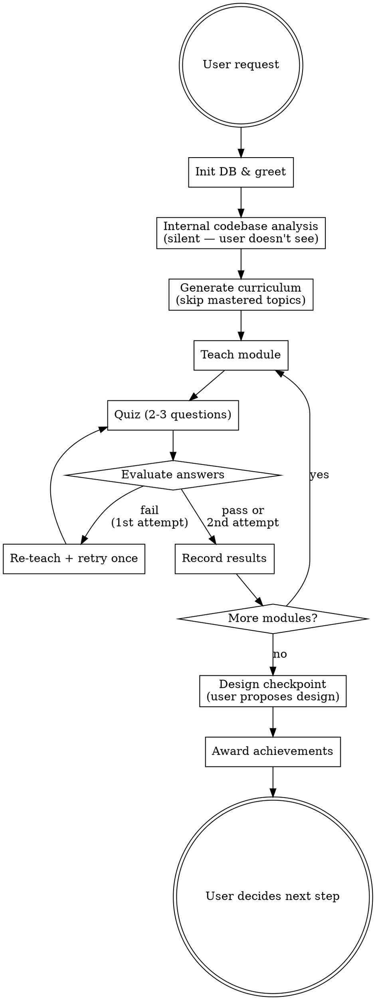

# Learning-First Plugin Implementation Plan

> **For agentic workers:** REQUIRED SUB-SKILL: Use superpowers:subagent-driven-development (recommended) or superpowers:executing-plans to implement this plan task-by-task. Steps use checkbox (`- [ ]`) syntax for tracking.

**Goal:** Build an installable plugin that replaces brainstorming with a teach-quiz-adapt learning flow, compatible with both Claude Code and GitHub Copilot CLI.

**Architecture:** A self-contained git repo with a SKILL.md defining agent behavior, backed by shell scripts for SQLite-based knowledge persistence. Scripts self-locate via `$(dirname "$0")` — no ambient env vars needed. The agent never writes code; it teaches, quizzes, and guides.

**Tech Stack:** Bash, SQLite3, Markdown (SKILL.md), JSON output from scripts

**Spec:** `docs/specs/2026-04-22-learning-first-design.md`

---

## File Map

| File | Responsibility |
|------|---------------|
| `package.json` | NPM metadata, version |
| `.claude-plugin/plugin.json` | Claude Code plugin manifest |
| `CLAUDE.md` | Claude Code agent instructions |
| `AGENTS.md` | Copilot CLI agent instructions |
| `schemas/knowledge.sql` | Full DB schema (6 tables) |
| `scripts/db-helper.sh` | Shared SQLite wrapper: path resolution, safe queries, init |
| `scripts/knowledge-db.sh` | Topic and repo knowledge CRUD |
| `scripts/curriculum.sh` | Curriculum lifecycle: create, advance, skip, resume |
| `scripts/quiz.sh` | Quiz result recording and stats |
| `scripts/achievements.sh` | Achievement tracking |
| `skills/learning-first/SKILL.md` | Core skill: agent behavior for learn-first flow |
| `skills/learning-first/curriculum-guide.md` | Guidance on dynamic curriculum generation |
| `tests/test-db-helper.sh` | DB helper unit tests |
| `tests/test-knowledge-db.sh` | Knowledge DB script tests |
| `tests/test-curriculum.sh` | Curriculum script tests |
| `tests/test-quiz.sh` | Quiz script tests |
| `tests/test-achievements.sh` | Achievement script tests |
| `tests/test-integration.sh` | Full flow integration test |
| `README.md` | Installation, usage, how it works |

---

### Task 1: Plugin Scaffold

**Files:**
- Create: `package.json`
- Create: `.claude-plugin/plugin.json`

- [ ] **Step 1: Create package.json**

```json
{
  "name": "learning-first",
  "version": "0.1.0",
  "description": "A learning-focused skill plugin that teaches before implementing — for team onboarding",
  "license": "MIT",
  "author": {
    "name": "Andre Bossard"
  },
  "repository": {
    "type": "git",
    "url": "https://github.com/abossard/andre-agents"
  },
  "keywords": [
    "skills",
    "learning",
    "onboarding",
    "curriculum",
    "teaching"
  ]
}
```

- [ ] **Step 2: Create .claude-plugin/plugin.json**

```bash
mkdir -p .claude-plugin
```

```json
{
  "name": "learning-first",
  "description": "A learning-focused skill plugin that teaches before implementing — for team onboarding",
  "version": "0.1.0",
  "author": {
    "name": "Andre Bossard"
  },
  "license": "MIT",
  "keywords": [
    "skills",
    "learning",
    "onboarding",
    "curriculum",
    "teaching"
  ]
}
```

- [ ] **Step 3: Commit scaffold**

```bash
git add package.json .claude-plugin/plugin.json
git commit -m "chore: add plugin scaffold with manifests"
```

---

### Task 2: DB Schema

**Files:**
- Create: `schemas/knowledge.sql`

- [ ] **Step 1: Create the full schema file**

This includes the 4 original tables plus 2 curriculum tables (identified during design critique).

```sql
-- Learning-First Knowledge Database Schema
-- Location: ~/.learning-first/knowledge.db

PRAGMA journal_mode=WAL;
PRAGMA busy_timeout=5000;
PRAGMA foreign_keys=ON;

-- What topics the user has encountered and learned
CREATE TABLE IF NOT EXISTS knowledge_topics (
    id TEXT PRIMARY KEY,
    domain TEXT NOT NULL,
    title TEXT NOT NULL,
    scope TEXT NOT NULL DEFAULT 'global',  -- 'global' or 'repo'
    depth_level INTEGER NOT NULL DEFAULT 1,
    status TEXT NOT NULL DEFAULT 'not_started',
    first_seen_at TEXT NOT NULL DEFAULT (datetime('now')),
    mastered_at TEXT,
    CHECK (depth_level BETWEEN 1 AND 3),
    CHECK (status IN ('not_started', 'in_progress', 'mastered', 'skipped')),
    CHECK (scope IN ('global', 'repo'))
);

-- Individual quiz question results
CREATE TABLE IF NOT EXISTS quiz_results (
    id INTEGER PRIMARY KEY AUTOINCREMENT,
    topic_id TEXT NOT NULL REFERENCES knowledge_topics(id),
    question TEXT NOT NULL,
    user_answer TEXT,
    correct INTEGER NOT NULL DEFAULT 0,
    feedback TEXT,
    depth_level INTEGER NOT NULL DEFAULT 1,
    asked_at TEXT NOT NULL DEFAULT (datetime('now')),
    CHECK (correct IN (0, 1)),
    CHECK (depth_level BETWEEN 1 AND 3)
);

-- Milestone achievements
CREATE TABLE IF NOT EXISTS achievements (
    id TEXT PRIMARY KEY,
    title TEXT NOT NULL,
    description TEXT,
    earned_at TEXT NOT NULL DEFAULT (datetime('now')),
    context TEXT
);

-- Per-repo area familiarity
CREATE TABLE IF NOT EXISTS repo_knowledge (
    repo_path TEXT NOT NULL,
    area TEXT NOT NULL,
    familiarity TEXT NOT NULL DEFAULT 'none',
    last_assessed_at TEXT NOT NULL DEFAULT (datetime('now')),
    PRIMARY KEY (repo_path, area),
    CHECK (familiarity IN ('none', 'basic', 'solid', 'expert'))
);

-- Curriculum sessions (one per task the user works on)
CREATE TABLE IF NOT EXISTS curricula (
    task_id TEXT PRIMARY KEY,
    repo_path TEXT,
    task_description TEXT,
    status TEXT NOT NULL DEFAULT 'active',
    current_module_index INTEGER NOT NULL DEFAULT 0,
    created_at TEXT NOT NULL DEFAULT (datetime('now')),
    completed_at TEXT,
    CHECK (status IN ('active', 'completed', 'abandoned'))
);

-- Individual modules within a curriculum
CREATE TABLE IF NOT EXISTS curriculum_modules (
    task_id TEXT NOT NULL REFERENCES curricula(task_id),
    module_index INTEGER NOT NULL,
    module_id TEXT NOT NULL,
    title TEXT NOT NULL,
    topic_id TEXT REFERENCES knowledge_topics(id),
    status TEXT NOT NULL DEFAULT 'pending',
    skipped_reason TEXT,
    score REAL,
    started_at TEXT,
    completed_at TEXT,
    PRIMARY KEY (task_id, module_index),
    CHECK (status IN ('pending', 'active', 'completed', 'skipped', 'failed'))
);
```

- [ ] **Step 2: Verify schema loads cleanly**

```bash
sqlite3 ":memory:" < schemas/knowledge.sql && echo "Schema OK" || echo "Schema FAIL"
```

Expected: `Schema OK`

- [ ] **Step 3: Commit schema**

```bash
git add schemas/knowledge.sql
git commit -m "feat: add knowledge database schema with curriculum tables"
```

---

### Task 3: Shared DB Helper Script

**Files:**
- Create: `scripts/db-helper.sh`

This is the foundation all other scripts use. It handles DB path, initialization, and safe SQL execution.

- [ ] **Step 1: Write a test for the helper**

Create `tests/test-db-helper.sh`:

```bash
#!/usr/bin/env bash
set -euo pipefail

SCRIPT_DIR="$(cd "$(dirname "$0")" && pwd)"
PROJECT_DIR="$(cd "$SCRIPT_DIR/.." && pwd)"
export LEARNING_FIRST_DB="/tmp/learning-first-test-$$.db"
trap 'rm -f "$LEARNING_FIRST_DB"' EXIT

PASS=0
FAIL=0

assert_eq() {
    local desc="$1" expected="$2" actual="$3"
    if [ "$expected" = "$actual" ]; then
        echo "  ✓ $desc"
        ((PASS++))
    else
        echo "  ✗ $desc"
        echo "    expected: $expected"
        echo "    actual:   $actual"
        ((FAIL++))
    fi
}

assert_ok() {
    local desc="$1"
    shift
    if "$@" > /dev/null 2>&1; then
        echo "  ✓ $desc"
        ((PASS++))
    else
        echo "  ✗ $desc (exit code $?)"
        ((FAIL++))
    fi
}

echo "=== db-helper.sh tests ==="

# Test: init creates the DB
echo "--- init ---"
source "$PROJECT_DIR/scripts/db-helper.sh"
assert_ok "db_init creates database" db_init
assert_eq "DB file exists" "true" "$([ -f "$LEARNING_FIRST_DB" ] && echo true || echo false)"

# Test: db_query runs SQL
echo "--- db_query ---"
result=$(db_query "SELECT COUNT(*) FROM knowledge_topics;")
assert_eq "empty topics table returns 0" "0" "$result"

# Test: db_exec runs INSERT
echo "--- db_exec ---"
db_exec "INSERT INTO knowledge_topics (id, domain, title) VALUES ('test-1', 'testing', 'Test Topic');"
result=$(db_query "SELECT title FROM knowledge_topics WHERE id='test-1';")
assert_eq "inserted topic retrievable" "Test Topic" "$result"

# Test: db_safe_value escapes quotes
echo "--- db_safe_value ---"
safe=$(db_safe_value "it's a \"test\"")
assert_eq "escapes single quotes" "it''s a \"test\"" "$safe"

# Test: db_json_query returns JSON
echo "--- db_json_query ---"
result=$(db_json_query "SELECT id, title FROM knowledge_topics WHERE id='test-1';")
echo "$result" | jq -e '.[0].id == "test-1"' > /dev/null 2>&1
assert_eq "JSON output is valid" "0" "$?"

echo ""
echo "Results: $PASS passed, $FAIL failed"
[ "$FAIL" -eq 0 ] || exit 1
```

- [ ] **Step 2: Run test to verify it fails**

```bash
chmod +x tests/test-db-helper.sh
bash tests/test-db-helper.sh
```

Expected: FAIL — `scripts/db-helper.sh` doesn't exist yet.

- [ ] **Step 3: Write db-helper.sh**

```bash
#!/usr/bin/env bash
# Shared database helper for Learning-First plugin.
# Source this file; do not execute directly.

set -euo pipefail

_LF_SCRIPT_DIR="$(cd "$(dirname "${BASH_SOURCE[0]}")" && pwd)"
_LF_PROJECT_DIR="$(cd "$_LF_SCRIPT_DIR/.." && pwd)"
_LF_SCHEMA="$_LF_PROJECT_DIR/schemas/knowledge.sql"

# DB location: env override > default
LEARNING_FIRST_DB="${LEARNING_FIRST_DB:-$HOME/.learning-first/knowledge.db}"

db_init() {
    local db_dir
    db_dir="$(dirname "$LEARNING_FIRST_DB")"
    mkdir -p "$db_dir"
    sqlite3 "$LEARNING_FIRST_DB" < "$_LF_SCHEMA"
}

db_query() {
    sqlite3 -batch -noheader "$LEARNING_FIRST_DB" "$1"
}

db_exec() {
    sqlite3 "$LEARNING_FIRST_DB" "$1"
}

db_json_query() {
    sqlite3 -json "$LEARNING_FIRST_DB" "$1"
}

db_safe_value() {
    local val="$1"
    echo "${val//\'/\'\'}"
}

db_ensure_init() {
    if [ ! -f "$LEARNING_FIRST_DB" ]; then
        db_init
    fi
}
```

- [ ] **Step 4: Run test to verify it passes**

```bash
bash tests/test-db-helper.sh
```

Expected: All tests pass.

- [ ] **Step 5: Commit**

```bash
git add scripts/db-helper.sh tests/test-db-helper.sh
git commit -m "feat: add shared db-helper with init, query, exec, json, escaping"
```

---

### Task 4: knowledge-db.sh

**Files:**
- Create: `scripts/knowledge-db.sh`

- [ ] **Step 1: Write tests**

Append to `tests/test-db-helper.sh` or create `tests/test-knowledge-db.sh`:

```bash
#!/usr/bin/env bash
set -euo pipefail

SCRIPT_DIR="$(cd "$(dirname "$0")" && pwd)"
PROJECT_DIR="$(cd "$SCRIPT_DIR/.." && pwd)"
export LEARNING_FIRST_DB="/tmp/learning-first-test-knowledge-$$.db"
trap 'rm -f "$LEARNING_FIRST_DB"' EXIT

PASS=0
FAIL=0

assert_eq() {
    local desc="$1" expected="$2" actual="$3"
    if [ "$expected" = "$actual" ]; then
        echo "  ✓ $desc"
        ((PASS++))
    else
        echo "  ✗ $desc"
        echo "    expected: $expected"
        echo "    actual:   $actual"
        ((FAIL++))
    fi
}

KDB="$PROJECT_DIR/scripts/knowledge-db.sh"

echo "=== knowledge-db.sh tests ==="

# Test: init
echo "--- init ---"
result=$("$KDB" init 2>&1)
assert_eq "init succeeds" "initialized" "$result"

# Test: upsert-topic (new)
echo "--- upsert-topic ---"
"$KDB" upsert-topic "jwt-basics" "authentication" "JWT Basics" "global" 1
result=$("$KDB" get-topic "jwt-basics" | jq -r '.[0].title')
assert_eq "upserted topic title" "JWT Basics" "$result"

# Test: upsert-topic (update depth)
"$KDB" upsert-topic "jwt-basics" "authentication" "JWT Basics" "global" 2
result=$("$KDB" get-topic "jwt-basics" | jq -r '.[0].depth_level')
assert_eq "updated depth level" "2" "$result"

# Test: update-topic-status
echo "--- update-topic-status ---"
"$KDB" update-topic-status "jwt-basics" "mastered"
result=$("$KDB" get-topic "jwt-basics" | jq -r '.[0].status')
assert_eq "status updated to mastered" "mastered" "$result"

# Test: update-repo-knowledge
echo "--- update-repo-knowledge ---"
"$KDB" update-repo-knowledge "/tmp/myrepo" "src/auth/" "basic"
result=$("$KDB" get-repo-knowledge "/tmp/myrepo" | jq -r '.[0].familiarity')
assert_eq "repo knowledge set" "basic" "$result"

# Test: get-profile (JSON output)
echo "--- get-profile ---"
result=$("$KDB" get-profile)
echo "$result" | jq -e '.topics | length > 0' > /dev/null 2>&1
assert_eq "profile has topics" "0" "$?"

echo ""
echo "Results: $PASS passed, $FAIL failed"
[ "$FAIL" -eq 0 ] || exit 1
```

- [ ] **Step 2: Run test to verify it fails**

```bash
chmod +x tests/test-knowledge-db.sh
bash tests/test-knowledge-db.sh
```

Expected: FAIL — `scripts/knowledge-db.sh` doesn't exist.

- [ ] **Step 3: Write knowledge-db.sh**

```bash
#!/usr/bin/env bash
set -euo pipefail

SCRIPT_DIR="$(cd "$(dirname "$0")" && pwd)"
source "$SCRIPT_DIR/db-helper.sh"

usage() {
    echo "Usage: knowledge-db.sh <command> [args...]"
    echo "Commands:"
    echo "  init                                          Initialize database"
    echo "  get-profile                                   Get full knowledge profile (JSON)"
    echo "  get-topic <topic_id>                          Get single topic (JSON)"
    echo "  upsert-topic <id> <domain> <title> <scope> <depth>  Create or update topic"
    echo "  update-topic-status <id> <status>             Update topic status"
    echo "  get-repo-knowledge <repo_path> [area]         Get repo familiarity (JSON)"
    echo "  update-repo-knowledge <repo> <area> <level>   Set repo area familiarity"
    exit 1
}

cmd_init() {
    db_init
    echo "initialized"
}

cmd_get_profile() {
    db_ensure_init
    local topics achievements repo_knowledge
    topics=$(db_json_query "SELECT * FROM knowledge_topics ORDER BY first_seen_at DESC;")
    achievements=$(db_json_query "SELECT * FROM achievements ORDER BY earned_at DESC;")
    repo_knowledge=$(db_json_query "SELECT * FROM repo_knowledge ORDER BY last_assessed_at DESC;")
    echo "{\"topics\":$topics,\"achievements\":$achievements,\"repo_knowledge\":$repo_knowledge}"
}

cmd_get_topic() {
    local topic_id="$1"
    db_ensure_init
    db_json_query "SELECT * FROM knowledge_topics WHERE id='$(db_safe_value "$topic_id")';"
}

cmd_upsert_topic() {
    local id="$1" domain="$2" title="$3" scope="$4" depth="$5"
    db_ensure_init
    local safe_id safe_domain safe_title safe_scope
    safe_id=$(db_safe_value "$id")
    safe_domain=$(db_safe_value "$domain")
    safe_title=$(db_safe_value "$title")
    safe_scope=$(db_safe_value "$scope")
    db_exec "INSERT INTO knowledge_topics (id, domain, title, scope, depth_level)
             VALUES ('$safe_id', '$safe_domain', '$safe_title', '$safe_scope', $depth)
             ON CONFLICT(id) DO UPDATE SET
               depth_level = MAX(knowledge_topics.depth_level, excluded.depth_level),
               domain = excluded.domain,
               title = excluded.title;"
}

cmd_update_topic_status() {
    local id="$1" status="$2"
    db_ensure_init
    local safe_id safe_status mastered_clause=""
    safe_id=$(db_safe_value "$id")
    safe_status=$(db_safe_value "$status")
    if [ "$status" = "mastered" ]; then
        mastered_clause=", mastered_at = datetime('now')"
    fi
    db_exec "UPDATE knowledge_topics SET status='$safe_status'$mastered_clause WHERE id='$safe_id';"
}

cmd_get_repo_knowledge() {
    local repo_path="$1"
    local area="${2:-}"
    db_ensure_init
    local safe_repo
    safe_repo=$(db_safe_value "$repo_path")
    if [ -n "$area" ]; then
        local safe_area
        safe_area=$(db_safe_value "$area")
        db_json_query "SELECT * FROM repo_knowledge WHERE repo_path='$safe_repo' AND area='$safe_area';"
    else
        db_json_query "SELECT * FROM repo_knowledge WHERE repo_path='$safe_repo';"
    fi
}

cmd_update_repo_knowledge() {
    local repo_path="$1" area="$2" familiarity="$3"
    db_ensure_init
    local safe_repo safe_area safe_fam
    safe_repo=$(db_safe_value "$repo_path")
    safe_area=$(db_safe_value "$area")
    safe_fam=$(db_safe_value "$familiarity")
    db_exec "INSERT INTO repo_knowledge (repo_path, area, familiarity)
             VALUES ('$safe_repo', '$safe_area', '$safe_fam')
             ON CONFLICT(repo_path, area) DO UPDATE SET
               familiarity = excluded.familiarity,
               last_assessed_at = datetime('now');"
}

# --- Main dispatch ---
[ $# -ge 1 ] || usage
command="$1"
shift

case "$command" in
    init)                cmd_init ;;
    get-profile)         cmd_get_profile ;;
    get-topic)           [ $# -ge 1 ] || usage; cmd_get_topic "$@" ;;
    upsert-topic)        [ $# -ge 5 ] || usage; cmd_upsert_topic "$@" ;;
    update-topic-status) [ $# -ge 2 ] || usage; cmd_update_topic_status "$@" ;;
    get-repo-knowledge)  [ $# -ge 1 ] || usage; cmd_get_repo_knowledge "$@" ;;
    update-repo-knowledge) [ $# -ge 3 ] || usage; cmd_update_repo_knowledge "$@" ;;
    *) usage ;;
esac
```

- [ ] **Step 4: Make executable and run tests**

```bash
chmod +x scripts/knowledge-db.sh
bash tests/test-knowledge-db.sh
```

Expected: All tests pass.

- [ ] **Step 5: Commit**

```bash
git add scripts/knowledge-db.sh tests/test-knowledge-db.sh
git commit -m "feat: add knowledge-db.sh with topic and repo knowledge CRUD"
```

---

### Task 5: curriculum.sh

**Files:**
- Create: `scripts/curriculum.sh`

- [ ] **Step 1: Write tests**

Create `tests/test-curriculum.sh`:

```bash
#!/usr/bin/env bash
set -euo pipefail

SCRIPT_DIR="$(cd "$(dirname "$0")" && pwd)"
PROJECT_DIR="$(cd "$SCRIPT_DIR/.." && pwd)"
export LEARNING_FIRST_DB="/tmp/learning-first-test-curriculum-$$.db"
trap 'rm -f "$LEARNING_FIRST_DB"' EXIT

PASS=0
FAIL=0

assert_eq() {
    local desc="$1" expected="$2" actual="$3"
    if [ "$expected" = "$actual" ]; then
        echo "  ✓ $desc"
        ((PASS++))
    else
        echo "  ✗ $desc"
        echo "    expected: $expected"
        echo "    actual:   $actual"
        ((FAIL++))
    fi
}

CUR="$PROJECT_DIR/scripts/curriculum.sh"
KDB="$PROJECT_DIR/scripts/knowledge-db.sh"

echo "=== curriculum.sh tests ==="

# Setup
"$KDB" init > /dev/null

MODULES='[{"module_id":"mod-jwt","title":"JWT Basics","topic_id":"jwt-basics"},{"module_id":"mod-middleware","title":"Middleware Patterns","topic_id":"middleware"}]'

# Test: create
echo "--- create ---"
"$CUR" create "task-1" "/tmp/repo" "Add JWT auth" "$MODULES"
result=$("$CUR" get-state "task-1" | jq -r '.status')
assert_eq "curriculum created" "active" "$result"

# Test: get-current
echo "--- get-current ---"
result=$("$CUR" get-current "task-1" | jq -r '.module_id')
assert_eq "first module is current" "mod-jwt" "$result"

# Test: set-module-status
echo "--- set-module-status ---"
"$CUR" set-module-status "task-1" 0 "completed"
result=$("$CUR" get-state "task-1" | jq -r '.modules[0].status')
assert_eq "module 0 completed" "completed" "$result"

# Test: advance
echo "--- advance ---"
"$CUR" advance "task-1"
result=$("$CUR" get-current "task-1" | jq -r '.module_id')
assert_eq "advanced to module 1" "mod-middleware" "$result"

# Test: skip
echo "--- skip ---"
"$CUR" set-module-status "task-1" 1 "skipped" "already familiar"
result=$("$CUR" get-state "task-1" | jq -r '.modules[1].skipped_reason')
assert_eq "skip reason recorded" "already familiar" "$result"

# Test: complete
echo "--- complete ---"
"$CUR" complete "task-1"
result=$("$CUR" get-state "task-1" | jq -r '.status')
assert_eq "curriculum completed" "completed" "$result"

# Test: abandon
echo "--- abandon test ---"
"$CUR" create "task-2" "/tmp/repo" "Another task" "$MODULES"
"$CUR" abandon "task-2"
result=$("$CUR" get-state "task-2" | jq -r '.status')
assert_eq "curriculum abandoned" "abandoned" "$result"

echo ""
echo "Results: $PASS passed, $FAIL failed"
[ "$FAIL" -eq 0 ] || exit 1
```

- [ ] **Step 2: Run test to verify it fails**

```bash
chmod +x tests/test-curriculum.sh
bash tests/test-curriculum.sh
```

Expected: FAIL — `scripts/curriculum.sh` doesn't exist.

- [ ] **Step 3: Write curriculum.sh**

```bash
#!/usr/bin/env bash
set -euo pipefail

SCRIPT_DIR="$(cd "$(dirname "$0")" && pwd)"
source "$SCRIPT_DIR/db-helper.sh"

usage() {
    echo "Usage: curriculum.sh <command> [args...]"
    echo "Commands:"
    echo "  create <task_id> <repo_path> <description> <modules_json>"
    echo "  get-state <task_id>                   Full curriculum state (JSON)"
    echo "  get-current <task_id>                  Current module (JSON)"
    echo "  advance <task_id>                      Move to next module"
    echo "  set-module-status <task_id> <index> <status> [reason]"
    echo "  complete <task_id>                     Mark curriculum done"
    echo "  abandon <task_id>                      Abandon curriculum"
    exit 1
}

cmd_create() {
    local task_id="$1" repo_path="$2" description="$3" modules_json="$4"
    db_ensure_init
    local safe_task safe_repo safe_desc
    safe_task=$(db_safe_value "$task_id")
    safe_repo=$(db_safe_value "$repo_path")
    safe_desc=$(db_safe_value "$description")
    db_exec "INSERT INTO curricula (task_id, repo_path, task_description)
             VALUES ('$safe_task', '$safe_repo', '$safe_desc');"

    # Parse JSON modules and insert each
    local count
    count=$(echo "$modules_json" | jq 'length')
    for ((i=0; i<count; i++)); do
        local mid mtitle mtopic
        mid=$(echo "$modules_json" | jq -r ".[$i].module_id")
        mtitle=$(echo "$modules_json" | jq -r ".[$i].title")
        mtopic=$(echo "$modules_json" | jq -r ".[$i].topic_id // empty")
        local safe_mid safe_mtitle safe_mtopic
        safe_mid=$(db_safe_value "$mid")
        safe_mtitle=$(db_safe_value "$mtitle")
        safe_mtopic=$(db_safe_value "${mtopic:-}")
        local topic_clause="NULL"
        [ -n "$mtopic" ] && topic_clause="'$safe_mtopic'"
        db_exec "INSERT INTO curriculum_modules (task_id, module_index, module_id, title, topic_id)
                 VALUES ('$safe_task', $i, '$safe_mid', '$safe_mtitle', $topic_clause);"
    done
}

cmd_get_state() {
    local task_id="$1"
    db_ensure_init
    local safe_task
    safe_task=$(db_safe_value "$task_id")
    local curriculum modules
    curriculum=$(db_json_query "SELECT * FROM curricula WHERE task_id='$safe_task';")
    modules=$(db_json_query "SELECT * FROM curriculum_modules WHERE task_id='$safe_task' ORDER BY module_index;")
    local status current_idx
    status=$(echo "$curriculum" | jq -r '.[0].status // "unknown"')
    current_idx=$(echo "$curriculum" | jq -r '.[0].current_module_index // 0')
    echo "{\"task_id\":\"$task_id\",\"status\":\"$status\",\"current_module_index\":$current_idx,\"modules\":$modules}"
}

cmd_get_current() {
    local task_id="$1"
    db_ensure_init
    local safe_task
    safe_task=$(db_safe_value "$task_id")
    local idx
    idx=$(db_query "SELECT current_module_index FROM curricula WHERE task_id='$safe_task';")
    db_json_query "SELECT * FROM curriculum_modules WHERE task_id='$safe_task' AND module_index=$idx;" | jq '.[0]'
}

cmd_advance() {
    local task_id="$1"
    db_ensure_init
    local safe_task
    safe_task=$(db_safe_value "$task_id")
    db_exec "UPDATE curricula SET current_module_index = current_module_index + 1 WHERE task_id='$safe_task';"
}

cmd_set_module_status() {
    local task_id="$1" index="$2" status="$3" reason="${4:-}"
    db_ensure_init
    local safe_task safe_status
    safe_task=$(db_safe_value "$task_id")
    safe_status=$(db_safe_value "$status")
    local reason_clause="NULL"
    if [ -n "$reason" ]; then
        local safe_reason
        safe_reason=$(db_safe_value "$reason")
        reason_clause="'$safe_reason'"
    fi
    local time_clause=""
    case "$status" in
        active)    time_clause=", started_at = datetime('now')" ;;
        completed) time_clause=", completed_at = datetime('now')" ;;
        skipped)   time_clause=", completed_at = datetime('now')" ;;
    esac
    db_exec "UPDATE curriculum_modules
             SET status='$safe_status', skipped_reason=$reason_clause$time_clause
             WHERE task_id='$safe_task' AND module_index=$index;"
}

cmd_complete() {
    local task_id="$1"
    db_ensure_init
    local safe_task
    safe_task=$(db_safe_value "$task_id")
    db_exec "UPDATE curricula SET status='completed', completed_at=datetime('now') WHERE task_id='$safe_task';"
}

cmd_abandon() {
    local task_id="$1"
    db_ensure_init
    local safe_task
    safe_task=$(db_safe_value "$task_id")
    db_exec "UPDATE curricula SET status='abandoned', completed_at=datetime('now') WHERE task_id='$safe_task';"
}

# --- Main dispatch ---
[ $# -ge 1 ] || usage
command="$1"
shift

case "$command" in
    create)            [ $# -ge 4 ] || usage; cmd_create "$@" ;;
    get-state)         [ $# -ge 1 ] || usage; cmd_get_state "$@" ;;
    get-current)       [ $# -ge 1 ] || usage; cmd_get_current "$@" ;;
    advance)           [ $# -ge 1 ] || usage; cmd_advance "$@" ;;
    set-module-status) [ $# -ge 3 ] || usage; cmd_set_module_status "$@" ;;
    complete)          [ $# -ge 1 ] || usage; cmd_complete "$@" ;;
    abandon)           [ $# -ge 1 ] || usage; cmd_abandon "$@" ;;
    *) usage ;;
esac
```

- [ ] **Step 4: Make executable and run tests**

```bash
chmod +x scripts/curriculum.sh
bash tests/test-curriculum.sh
```

Expected: All tests pass.

- [ ] **Step 5: Commit**

```bash
git add scripts/curriculum.sh tests/test-curriculum.sh
git commit -m "feat: add curriculum.sh with create, advance, skip, abandon lifecycle"
```

---

### Task 6: quiz.sh

**Files:**
- Create: `scripts/quiz.sh`

- [ ] **Step 1: Write tests**

Create `tests/test-quiz.sh`:

```bash
#!/usr/bin/env bash
set -euo pipefail

SCRIPT_DIR="$(cd "$(dirname "$0")" && pwd)"
PROJECT_DIR="$(cd "$SCRIPT_DIR/.." && pwd)"
export LEARNING_FIRST_DB="/tmp/learning-first-test-quiz-$$.db"
trap 'rm -f "$LEARNING_FIRST_DB"' EXIT

PASS=0
FAIL=0

assert_eq() {
    local desc="$1" expected="$2" actual="$3"
    if [ "$expected" = "$actual" ]; then
        echo "  ✓ $desc"
        ((PASS++))
    else
        echo "  ✗ $desc"
        echo "    expected: $expected"
        echo "    actual:   $actual"
        ((FAIL++))
    fi
}

QUIZ="$PROJECT_DIR/scripts/quiz.sh"
KDB="$PROJECT_DIR/scripts/knowledge-db.sh"

echo "=== quiz.sh tests ==="

# Setup
"$KDB" init > /dev/null
"$KDB" upsert-topic "jwt-basics" "auth" "JWT Basics" "global" 1

# Test: record correct answer
echo "--- record ---"
"$QUIZ" record "jwt-basics" "What does JWT stand for?" "JSON Web Token" 1 "Correct!" 1
result=$("$QUIZ" history "jwt-basics" | jq 'length')
assert_eq "one result recorded" "1" "$result"

# Test: record wrong answer
"$QUIZ" record "jwt-basics" "What is the header for?" "Authentication" 0 "Not quite — it contains metadata" 1
result=$("$QUIZ" history "jwt-basics" | jq 'length')
assert_eq "two results recorded" "2" "$result"

# Test: stats
echo "--- stats ---"
result=$("$QUIZ" stats)
total=$(echo "$result" | jq -r '.[0].total')
correct=$(echo "$result" | jq -r '.[0].correct')
assert_eq "total questions" "2" "$total"
assert_eq "correct answers" "1" "$correct"

# Test: topic-stats
echo "--- topic-stats ---"
result=$("$QUIZ" topic-stats "jwt-basics")
pct=$(echo "$result" | jq -r '.[0].pct_correct')
assert_eq "50% correct" "50" "$pct"

# Test: answer with quotes (injection safety)
echo "--- injection safety ---"
"$QUIZ" record "jwt-basics" "What's the token format?" "It's base64" 1 "That's right" 1
result=$("$QUIZ" history "jwt-basics" | jq 'length')
assert_eq "quote in answer handled" "3" "$result"

echo ""
echo "Results: $PASS passed, $FAIL failed"
[ "$FAIL" -eq 0 ] || exit 1
```

- [ ] **Step 2: Run test to verify it fails**

```bash
chmod +x tests/test-quiz.sh
bash tests/test-quiz.sh
```

Expected: FAIL — `scripts/quiz.sh` doesn't exist.

- [ ] **Step 3: Write quiz.sh**

```bash
#!/usr/bin/env bash
set -euo pipefail

SCRIPT_DIR="$(cd "$(dirname "$0")" && pwd)"
source "$SCRIPT_DIR/db-helper.sh"

usage() {
    echo "Usage: quiz.sh <command> [args...]"
    echo "Commands:"
    echo "  record <topic_id> <question> <answer> <correct:0|1> <feedback> <depth>"
    echo "  history <topic_id>            Quiz history for topic (JSON)"
    echo "  stats                         Overall quiz stats (JSON)"
    echo "  topic-stats <topic_id>        Stats for one topic (JSON)"
    exit 1
}

cmd_record() {
    local topic_id="$1" question="$2" answer="$3" correct="$4" feedback="$5" depth="$6"
    db_ensure_init
    local sq sa sf st
    st=$(db_safe_value "$topic_id")
    sq=$(db_safe_value "$question")
    sa=$(db_safe_value "$answer")
    sf=$(db_safe_value "$feedback")
    db_exec "INSERT INTO quiz_results (topic_id, question, user_answer, correct, feedback, depth_level)
             VALUES ('$st', '$sq', '$sa', $correct, '$sf', $depth);"
}

cmd_history() {
    local topic_id="$1"
    db_ensure_init
    local safe_topic
    safe_topic=$(db_safe_value "$topic_id")
    db_json_query "SELECT * FROM quiz_results WHERE topic_id='$safe_topic' ORDER BY asked_at DESC;"
}

cmd_stats() {
    db_ensure_init
    db_json_query "SELECT
        COUNT(*) as total,
        SUM(correct) as correct,
        ROUND(100.0 * SUM(correct) / MAX(COUNT(*), 1)) as pct_correct,
        COUNT(DISTINCT topic_id) as topics_quizzed
    FROM quiz_results;"
}

cmd_topic_stats() {
    local topic_id="$1"
    db_ensure_init
    local safe_topic
    safe_topic=$(db_safe_value "$topic_id")
    db_json_query "SELECT
        COUNT(*) as total,
        SUM(correct) as correct,
        ROUND(100.0 * SUM(correct) / MAX(COUNT(*), 1)) as pct_correct,
        MAX(depth_level) as max_depth
    FROM quiz_results WHERE topic_id='$safe_topic';"
}

# --- Main dispatch ---
[ $# -ge 1 ] || usage
command="$1"
shift

case "$command" in
    record)      [ $# -ge 6 ] || usage; cmd_record "$@" ;;
    history)     [ $# -ge 1 ] || usage; cmd_history "$@" ;;
    stats)       cmd_stats ;;
    topic-stats) [ $# -ge 1 ] || usage; cmd_topic_stats "$@" ;;
    *) usage ;;
esac
```

- [ ] **Step 4: Make executable and run tests**

```bash
chmod +x scripts/quiz.sh
bash tests/test-quiz.sh
```

Expected: All tests pass.

- [ ] **Step 5: Commit**

```bash
git add scripts/quiz.sh tests/test-quiz.sh
git commit -m "feat: add quiz.sh with record, history, stats, topic-stats"
```

---

### Task 7: achievements.sh

**Files:**
- Create: `scripts/achievements.sh`

- [ ] **Step 1: Write tests**

Create `tests/test-achievements.sh`:

```bash
#!/usr/bin/env bash
set -euo pipefail

SCRIPT_DIR="$(cd "$(dirname "$0")" && pwd)"
PROJECT_DIR="$(cd "$SCRIPT_DIR/.." && pwd)"
export LEARNING_FIRST_DB="/tmp/learning-first-test-ach-$$.db"
trap 'rm -f "$LEARNING_FIRST_DB"' EXIT

PASS=0
FAIL=0

assert_eq() {
    local desc="$1" expected="$2" actual="$3"
    if [ "$expected" = "$actual" ]; then
        echo "  ✓ $desc"
        ((PASS++))
    else
        echo "  ✗ $desc"
        echo "    expected: $expected"
        echo "    actual:   $actual"
        ((FAIL++))
    fi
}

ACH="$PROJECT_DIR/scripts/achievements.sh"
KDB="$PROJECT_DIR/scripts/knowledge-db.sh"

echo "=== achievements.sh tests ==="

# Setup
"$KDB" init > /dev/null

# Test: award
echo "--- award ---"
"$ACH" award "explorer-myrepo" "Explorer: myrepo" "First task in myrepo" "Add JWT auth"
result=$("$ACH" list | jq 'length')
assert_eq "one achievement" "1" "$result"

# Test: check (exists)
echo "--- check ---"
result=$("$ACH" check "explorer-myrepo")
assert_eq "achievement exists" "true" "$result"

# Test: check (not exists)
result=$("$ACH" check "nonexistent")
assert_eq "achievement not exists" "false" "$result"

# Test: duplicate award is idempotent
echo "--- idempotent award ---"
"$ACH" award "explorer-myrepo" "Explorer: myrepo" "First task" "context"
result=$("$ACH" list | jq 'length')
assert_eq "still one achievement (no duplicate)" "1" "$result"

# Test: list multiple
echo "--- list ---"
"$ACH" award "mastered-jwt" "Mastered: JWT" "Deep understanding of JWT" "JWT Auth task"
result=$("$ACH" list | jq 'length')
assert_eq "two achievements" "2" "$result"

echo ""
echo "Results: $PASS passed, $FAIL failed"
[ "$FAIL" -eq 0 ] || exit 1
```

- [ ] **Step 2: Run test to verify it fails**

```bash
chmod +x tests/test-achievements.sh
bash tests/test-achievements.sh
```

Expected: FAIL — `scripts/achievements.sh` doesn't exist.

- [ ] **Step 3: Write achievements.sh**

```bash
#!/usr/bin/env bash
set -euo pipefail

SCRIPT_DIR="$(cd "$(dirname "$0")" && pwd)"
source "$SCRIPT_DIR/db-helper.sh"

usage() {
    echo "Usage: achievements.sh <command> [args...]"
    echo "Commands:"
    echo "  award <id> <title> <description> [context]   Award achievement (idempotent)"
    echo "  list                                          List all achievements (JSON)"
    echo "  check <id>                                    Check if earned (true/false)"
    exit 1
}

cmd_award() {
    local id="$1" title="$2" description="$3" context="${4:-}"
    db_ensure_init
    local si st sd sc
    si=$(db_safe_value "$id")
    st=$(db_safe_value "$title")
    sd=$(db_safe_value "$description")
    sc=$(db_safe_value "$context")
    db_exec "INSERT OR IGNORE INTO achievements (id, title, description, context)
             VALUES ('$si', '$st', '$sd', '$sc');"
}

cmd_list() {
    db_ensure_init
    db_json_query "SELECT * FROM achievements ORDER BY earned_at DESC;"
}

cmd_check() {
    local id="$1"
    db_ensure_init
    local safe_id
    safe_id=$(db_safe_value "$id")
    local count
    count=$(db_query "SELECT COUNT(*) FROM achievements WHERE id='$safe_id';")
    if [ "$count" -gt 0 ]; then
        echo "true"
    else
        echo "false"
    fi
}

# --- Main dispatch ---
[ $# -ge 1 ] || usage
command="$1"
shift

case "$command" in
    award) [ $# -ge 3 ] || usage; cmd_award "$@" ;;
    list)  cmd_list ;;
    check) [ $# -ge 1 ] || usage; cmd_check "$@" ;;
    *) usage ;;
esac
```

- [ ] **Step 4: Make executable and run tests**

```bash
chmod +x scripts/achievements.sh
bash tests/test-achievements.sh
```

Expected: All tests pass.

- [ ] **Step 5: Commit**

```bash
git add scripts/achievements.sh tests/test-achievements.sh
git commit -m "feat: add achievements.sh with award, list, check (idempotent)"
```

---

### Task 8: curriculum-guide.md

**Files:**
- Create: `skills/learning-first/curriculum-guide.md`

This guides the agent on HOW to generate curriculum dynamically. Referenced by SKILL.md.

- [ ] **Step 1: Write curriculum-guide.md**

```markdown
# Curriculum Generation Guide

## How to Build a Task-Specific Curriculum

When a user requests work on a codebase, generate a curriculum that covers exactly what
they need to understand to make good design decisions for THIS task in THIS codebase.

### Step 1: Analyze the Task

Identify the concepts involved:
- **Codebase-specific:** What existing patterns, modules, and conventions does this task touch?
- **Conceptual:** What general CS/engineering concepts does this task require?
- **Framework-specific:** What framework features or patterns are involved?
- **Design:** What architectural decisions will need to be made?

### Step 2: Check Prior Knowledge

Query the user's knowledge profile:
```
bash "$PLUGIN_DIR/scripts/knowledge-db.sh" get-profile
bash "$PLUGIN_DIR/scripts/knowledge-db.sh" get-repo-knowledge <repo_path>
```

For each concept the task involves:
- If the user has mastered it → skip entirely
- If the user has seen it before → increase depth level
- If the user has never seen it → start at Level 1

### Step 3: Build Modules

Create 2-6 modules ordered from concrete (codebase) to abstract (design):

1. **Codebase orientation** — What does this part of the codebase do? Show real files.
2. **Core concepts** — The fundamental ideas needed (e.g., "What is JWT?")
3. **Framework patterns** — How the framework handles this (e.g., "Express middleware")
4. **Integration points** — How this connects to existing code
5. **Design considerations** — Trade-offs, alternatives, security implications

Not every task needs all 5 types. A simple bug fix might only need modules 1 and 4.

### Step 4: Calibrate Depth

| User's Prior Level | This Session's Depth | Question Style |
|--------------------|---------------------|----------------|
| Never seen | Level 1 (Intro) | Multiple choice, concept recognition |
| Seen before, Level 1 | Level 2 (Intermediate) | Scenario-based, apply to codebase |
| Seen before, Level 2+ | Level 3 (Deep) | Open-ended design critique |

### Step 5: Format for Script

Create the modules JSON for `curriculum.sh create`:

```json
[
  {
    "module_id": "codebase-auth-layer",
    "title": "Understanding the Auth Layer",
    "topic_id": "repo-specific-auth"
  },
  {
    "module_id": "jwt-fundamentals",
    "title": "JWT Fundamentals",
    "topic_id": "jwt-basics"
  }
]
```

## Teaching Principles

- **Show, don't tell** — Use real code from the codebase as examples
- **Anchor to what they know** — Connect new concepts to topics they've mastered
- **One idea per module** — Don't overload
- **Context before detail** — Explain WHY before HOW
- **Never give the solution** — Guide them to understand, not to copy

## Quiz Design

- **Level 1:** "What does X mean?" / "Which of these describes Y?"
- **Level 2:** "Looking at `path/to/file.ts`, what would happen if Z?"
- **Level 3:** "The current implementation does X. What are the trade-offs and alternatives?"

Always use the `ask_user` tool for quizzes — prefer multiple choice at L1/L2, open-ended at L3.

## Scoring

- 2-3 questions per module
- ≥ 66% correct at current level → advance to next module
- < 66% correct → re-teach key points, ask 1-2 more questions, then move on
- Record ALL results via `quiz.sh record`
```

- [ ] **Step 2: Commit**

```bash
mkdir -p skills/learning-first
git add skills/learning-first/curriculum-guide.md
git commit -m "docs: add curriculum generation guide for agents"
```

---

### Task 9: Core SKILL.md

**Files:**
- Create: `skills/learning-first/SKILL.md`

This is the most important file — it defines all agent behavior.

- [ ] **Step 1: Write SKILL.md**

```markdown
---
name: learning-first
description: "Use INSTEAD of brainstorming for any creative work. Teaches the user about the codebase and concepts before proceeding to design and implementation. The agent NEVER writes code — it guides the user to understand."
---

# Learning First

Replace brainstorming with a learning-first workflow. Before any implementation, teach the
user the concepts they need to make informed design decisions. The agent NEVER writes or
changes code — it teaches, quizzes, and guides.

<HARD-GATE>
Do NOT write, suggest, or generate any implementation code. Do NOT create implementation
plans. Do NOT invoke writing-plans or any implementation skill. Your ONLY job is to teach
and assess understanding. Once the user demonstrates understanding, transition them to make
their OWN design decisions with your guidance.
</HARD-GATE>

## Primary Objective

The user should learn enough to work WITHOUT AI assistance. Every interaction should
build genuine understanding, not dependency.

## Plugin Directory

All scripts are located relative to this skill file:
```
PLUGIN_DIR="$(cd "$(dirname "$0")/../.." && pwd)"
```

When calling scripts, use:
```bash
bash "$PLUGIN_DIR/scripts/knowledge-db.sh" <command>
bash "$PLUGIN_DIR/scripts/curriculum.sh" <command>
bash "$PLUGIN_DIR/scripts/quiz.sh" <command>
bash "$PLUGIN_DIR/scripts/achievements.sh" <command>
```

Replace $PLUGIN_DIR with the actual resolved path from the skill file location.

## Checklist

You MUST complete these steps in order:

1. **Initialize & greet** — init DB, show achievements, welcome the user
2. **Internal analysis** — silently analyze the codebase and task (do NOT share raw analysis)
3. **Generate curriculum** — build learning modules, register with curriculum.sh
4. **Teach + Quiz loop** — for each module: teach → quiz → evaluate → record
5. **Design checkpoint** — guide user to propose their own design (don't propose FOR them)
6. **Record & celebrate** — save progress, award achievements

## Process Flow



## Step Details

### 1. Initialize & Greet

```bash
bash "$PLUGIN_DIR/scripts/knowledge-db.sh" init
bash "$PLUGIN_DIR/scripts/knowledge-db.sh" get-profile
bash "$PLUGIN_DIR/scripts/achievements.sh" list
```

If the user has prior achievements, mention them warmly:
> "Welcome back! You've earned: **Mastered: Database Layer**, **Explorer: project-name**."

If new user:
> "Welcome! I'll help you understand this codebase before we dive into implementation."

### 2. Internal Analysis (Silent)

Analyze the codebase WITHOUT sharing your findings directly with the user:
- Explore the project structure, frameworks, dependencies
- Understand existing patterns in the area the task touches
- Identify the concepts the user needs to understand
- Determine what a good implementation approach would look like

This analysis informs the curriculum but stays internal. The user should DISCOVER
these things through the learning modules, not be told them.

**Do NOT invoke the brainstorming skill.** Perform your own analysis using explore
agents or direct file/grep searches.

### 3. Generate Curriculum

Read `curriculum-guide.md` (in this skill's directory) for detailed guidance.

Present the curriculum overview to the user:
> "To work on this task effectively, I've prepared a learning path:"
> 1. Understanding the Auth Layer (this codebase)
> 2. JWT Fundamentals
> 3. Express Middleware Patterns
> 4. Security Considerations
>
> "Some of these may be familiar — we'll adjust as we go. Ready to start?"

Register with the scripts:
```bash
bash "$PLUGIN_DIR/scripts/curriculum.sh" create "<task-id>" "<repo-path>" "<description>" '<modules-json>'
```

### 4. Teach + Quiz Loop

For each module:

**a) Teach** — Explain the concept using real code from the codebase.
- Show actual files and code snippets
- Explain WHY things are done this way, not just WHAT
- Connect to concepts the user already knows
- Keep it focused — one core idea per module

**b) Quiz** — Ask 2-3 questions using `ask_user`:
- Level 1: Multiple choice
- Level 2: Scenario-based ("What would happen if...")
- Level 3: Open-ended design questions

**c) Evaluate** — Judge the answer conversationally:
- "Good enough" counts — don't be pedantic
- If wrong: re-explain the key point, ask ONE more question
- If the user says "skip" / "I know this" / "let's move on" → respect it

**d) Record** — Store results:
```bash
bash "$PLUGIN_DIR/scripts/quiz.sh" record "<topic_id>" "<question>" "<answer>" <0|1> "<feedback>" <depth>
bash "$PLUGIN_DIR/scripts/curriculum.sh" set-module-status "<task-id>" <index> "completed"
bash "$PLUGIN_DIR/scripts/curriculum.sh" advance "<task-id>"
```

For skips:
```bash
bash "$PLUGIN_DIR/scripts/curriculum.sh" set-module-status "<task-id>" <index> "skipped" "user requested skip"
bash "$PLUGIN_DIR/scripts/curriculum.sh" advance "<task-id>"
```

### 5. Design Checkpoint

**Do NOT propose a design.** Instead, guide the user to propose their own:

> "Now that you understand the key concepts, how would YOU approach implementing this?
> Think about:
> - Where in the codebase would you make changes?
> - What patterns from the existing code would you follow?
> - What are the security considerations?
>
> Take your time — there's no wrong answer."

Respond to their design by:
- Asking probing questions about gaps
- Highlighting trade-offs they may not have considered
- Affirming good instincts
- Nudging toward better approaches WITHOUT giving the answer

**Never say "here's how I'd do it."** Say "what would happen if you considered X?"

### 6. Record & Celebrate

Update knowledge state:
```bash
bash "$PLUGIN_DIR/scripts/knowledge-db.sh" update-topic-status "<topic-id>" "mastered"
bash "$PLUGIN_DIR/scripts/knowledge-db.sh" update-repo-knowledge "<repo>" "<area>" "basic|solid"
bash "$PLUGIN_DIR/scripts/curriculum.sh" complete "<task-id>"
```

Award achievements based on milestones:
```bash
bash "$PLUGIN_DIR/scripts/achievements.sh" award "<id>" "<title>" "<description>" "<context>"
```

Achievement triggers:
- First task in a new repo → "Explorer: <repo-name>"
- Mastered a topic area → "Mastered: <topic>"
- Completed all modules for a task → "Ready to Ship: <task>"
- Returned and deepened knowledge → "Deepening: <topic> (L1→L2)"

Announce achievements:
> "🏆 Achievement earned: **Ready to Ship: JWT Auth**
> You've demonstrated solid understanding of the concepts needed for this task."

Then let the user decide what to do next:
> "You're now equipped to implement this. Would you like to:
> - Start implementing on your own
> - Use a different agent/skill for assisted implementation
> - Explore another topic first"

## The Skip Escape Hatch

At ANY point the user can say "skip", "I know this", or "let's move on":
- Record the skip
- Move to the next module
- Do NOT shame, pressure, or question the skip
- Do NOT ask "are you sure?"

## Key Principles

- **Never write code** — teach concepts, show existing code, ask questions
- **Never give solutions** — guide the user to discover answers
- **One question at a time** — don't overwhelm
- **Show real code** — always use actual codebase examples, not hypotheticals
- **Respect the skip** — the user is in control
- **Build independence** — every interaction should make the user MORE capable of working alone
```

- [ ] **Step 2: Commit**

```bash
git add skills/learning-first/SKILL.md
git commit -m "feat: add core learning-first skill with teach-quiz-adapt flow"
```

---

### Task 10: CLAUDE.md & AGENTS.md

**Files:**
- Create: `CLAUDE.md`
- Create: `AGENTS.md`

- [ ] **Step 1: Write CLAUDE.md**

```markdown
# Learning-First Plugin

This plugin provides the `learning-first` skill — a learning-focused alternative to
brainstorming that teaches before implementing.

## Available Skills

- **learning-first** — Use instead of brainstorming. Teaches the user about the codebase
  and relevant concepts before proceeding to design. The agent never writes code.

## Script Location

All helper scripts are in the `scripts/` directory of this plugin. The skill file
references them via relative paths from its own location.

## Knowledge Database

User progress is stored in `~/.learning-first/knowledge.db` (SQLite).
Override with the `LEARNING_FIRST_DB` environment variable for testing.
```

- [ ] **Step 2: Write AGENTS.md**

```markdown
# Learning-First Plugin

This plugin provides the `learning-first` skill — a learning-focused alternative to
brainstorming that teaches before implementing.

## Available Skills

- **learning-first** — Use instead of brainstorming. Teaches the user about the codebase
  and relevant concepts before proceeding to design. The agent never writes code.

## Script Location

All helper scripts are in the `scripts/` directory of this plugin. The skill file
references them via relative paths from its own location.

## Knowledge Database

User progress is stored in `~/.learning-first/knowledge.db` (SQLite).
Override with the `LEARNING_FIRST_DB` environment variable for testing.
```

- [ ] **Step 3: Commit**

```bash
git add CLAUDE.md AGENTS.md
git commit -m "docs: add CLAUDE.md and AGENTS.md for plugin discovery"
```

---

### Task 11: Integration Tests

**Files:**
- Create: `tests/test-integration.sh`

- [ ] **Step 1: Write integration test**

```bash
#!/usr/bin/env bash
set -euo pipefail

SCRIPT_DIR="$(cd "$(dirname "$0")" && pwd)"
PROJECT_DIR="$(cd "$SCRIPT_DIR/.." && pwd)"
export LEARNING_FIRST_DB="/tmp/learning-first-test-integration-$$.db"
trap 'rm -f "$LEARNING_FIRST_DB"' EXIT

PASS=0
FAIL=0

assert_eq() {
    local desc="$1" expected="$2" actual="$3"
    if [ "$expected" = "$actual" ]; then
        echo "  ✓ $desc"
        ((PASS++))
    else
        echo "  ✗ $desc"
        echo "    expected: $expected"
        echo "    actual:   $actual"
        ((FAIL++))
    fi
}

KDB="$PROJECT_DIR/scripts/knowledge-db.sh"
CUR="$PROJECT_DIR/scripts/curriculum.sh"
QUIZ="$PROJECT_DIR/scripts/quiz.sh"
ACH="$PROJECT_DIR/scripts/achievements.sh"

echo "=== Integration Test: Full Learning Flow ==="

# 1. Initialize
echo "--- Phase 1: Init ---"
"$KDB" init > /dev/null
profile=$("$KDB" get-profile)
assert_eq "empty profile" "0" "$(echo "$profile" | jq '.topics | length')"

# 2. Create curriculum
echo "--- Phase 2: Create Curriculum ---"
MODULES='[
  {"module_id":"mod-auth-layer","title":"Auth Layer","topic_id":"auth-layer"},
  {"module_id":"mod-jwt","title":"JWT Basics","topic_id":"jwt-basics"},
  {"module_id":"mod-security","title":"Security","topic_id":"security"}
]'
"$KDB" upsert-topic "auth-layer" "architecture" "Auth Layer Overview" "repo" 1
"$KDB" upsert-topic "jwt-basics" "authentication" "JWT Basics" "global" 1
"$KDB" upsert-topic "security" "security" "Security Considerations" "global" 1
"$CUR" create "task-jwt-auth" "/tmp/myrepo" "Add JWT auth" "$MODULES"
state=$("$CUR" get-state "task-jwt-auth")
assert_eq "3 modules created" "3" "$(echo "$state" | jq '.modules | length')"

# 3. Simulate teach+quiz for module 0
echo "--- Phase 3: Module 0 (Auth Layer) ---"
"$CUR" set-module-status "task-jwt-auth" 0 "active"
"$QUIZ" record "auth-layer" "What pattern does the auth layer use?" "Middleware" 1 "Correct!" 1
"$QUIZ" record "auth-layer" "Where is auth configured?" "src/auth/config.ts" 1 "Right!" 1
"$CUR" set-module-status "task-jwt-auth" 0 "completed"
"$CUR" advance "task-jwt-auth"
"$KDB" update-topic-status "auth-layer" "mastered"

current=$("$CUR" get-current "task-jwt-auth")
assert_eq "advanced to module 1" "mod-jwt" "$(echo "$current" | jq -r '.module_id')"

# 4. Module 1 — user skips
echo "--- Phase 4: Module 1 (JWT — skipped) ---"
"$CUR" set-module-status "task-jwt-auth" 1 "skipped" "user said: I know this"
"$CUR" advance "task-jwt-auth"
"$KDB" update-topic-status "jwt-basics" "skipped"

# 5. Module 2 — mixed results
echo "--- Phase 5: Module 2 (Security) ---"
"$CUR" set-module-status "task-jwt-auth" 2 "active"
"$QUIZ" record "security" "What is CSRF?" "Cross-site request forgery" 1 "Correct" 1
"$QUIZ" record "security" "How to prevent XSS?" "I don't know" 0 "XSS is prevented by..." 1
"$CUR" set-module-status "task-jwt-auth" 2 "completed"
"$KDB" update-topic-status "security" "in_progress"

# 6. Complete curriculum
echo "--- Phase 6: Complete ---"
"$CUR" complete "task-jwt-auth"
state=$("$CUR" get-state "task-jwt-auth")
assert_eq "curriculum completed" "completed" "$(echo "$state" | jq -r '.status')"

# 7. Award achievements
echo "--- Phase 7: Achievements ---"
"$ACH" award "explorer-myrepo" "Explorer: myrepo" "First task in myrepo" "JWT auth"
"$ACH" award "ready-jwt-auth" "Ready to Ship: JWT Auth" "Completed learning for JWT auth" "task-jwt-auth"
result=$("$ACH" list | jq 'length')
assert_eq "2 achievements earned" "2" "$result"

# 8. Verify final profile
echo "--- Phase 8: Final Profile ---"
profile=$("$KDB" get-profile)
topics=$(echo "$profile" | jq '.topics | length')
assert_eq "3 topics in profile" "3" "$topics"

mastered=$(echo "$profile" | jq '[.topics[] | select(.status == "mastered")] | length')
assert_eq "1 mastered topic" "1" "$mastered"

# 9. Quiz stats
echo "--- Phase 9: Quiz Stats ---"
stats=$("$QUIZ" stats)
total=$(echo "$stats" | jq -r '.[0].total')
correct=$(echo "$stats" | jq -r '.[0].correct')
assert_eq "total quiz questions" "4" "$total"
assert_eq "correct answers" "3" "$correct"

echo ""
echo "=== Results: $PASS passed, $FAIL failed ==="
[ "$FAIL" -eq 0 ] || exit 1
```

- [ ] **Step 2: Run integration test**

```bash
chmod +x tests/test-integration.sh
bash tests/test-integration.sh
```

Expected: All tests pass.

- [ ] **Step 3: Run ALL test files**

```bash
for f in tests/test-*.sh; do echo "=== $f ===" && bash "$f" && echo "" || exit 1; done
```

Expected: All test files pass.

- [ ] **Step 4: Commit**

```bash
git add tests/test-integration.sh
git commit -m "test: add integration test simulating full learning flow"
```

---

### Task 12: README.md

**Files:**
- Create: `README.md`

- [ ] **Step 1: Write README.md**

```markdown
# Learning-First

A learning-focused skill plugin for [Claude Code](https://docs.anthropic.com/en/docs/claude-code)
and [GitHub Copilot CLI](https://githubnext.com/projects/copilot-cli/) that teaches before
implementing.

## What It Does

When you ask an AI agent to implement something, **Learning-First** intercepts and runs a
learning flow first:

1. **Analyzes** the codebase and task to identify what you need to understand
2. **Generates a curriculum** tailored to your current knowledge level
3. **Teaches** concepts using real examples from the codebase
4. **Quizzes** you to assess understanding (always skippable)
5. **Adapts** depth based on your performance — returning to the same topic goes deeper
6. **Guides** you to propose your own design instead of giving you the answer

The agent **never writes code**. It builds your understanding so you can implement confidently.

## Installation

### Claude Code

```bash
# Clone the repo
git clone https://github.com/abossard/andre-agents.git

# Add as a plugin
claude plugin add /path/to/andre-agents
```

### GitHub Copilot CLI

Clone or symlink to your Copilot CLI plugin discovery directory.

### Updates

```bash
cd /path/to/andre-agents && git pull
```

## How It Works

### Knowledge Tracking

Your learning progress is stored locally in `~/.learning-first/knowledge.db` (SQLite).
This tracks:

- **Topics** you've encountered and their depth level (1-3)
- **Quiz results** for adaptive difficulty
- **Repo-specific knowledge** — familiarity with different areas of each codebase
- **Achievements** — milestones earned through demonstrated understanding

### Adaptive Depth

| Encounter | Level | What You Learn |
|-----------|-------|---------------|
| 1st time | Level 1 | Fundamentals — what, why, basic structure |
| 2nd time | Level 2 | Intermediate — edge cases, patterns, integration |
| 3rd+ time | Level 3 | Deep — security, trade-offs, design critique |

### Achievements

Earn milestones as you learn:

- **Explorer: project-name** — First task in a new repo
- **Mastered: Topic Name** — Demonstrated deep understanding
- **Ready to Ship: Task** — Completed all learning for a task
- **Deepening: Topic (L1→L2)** — Returned and went deeper

## Scripts

Helper scripts manage the knowledge database. You can use them directly:

```bash
# Check your learning profile
./scripts/knowledge-db.sh get-profile

# View quiz stats
./scripts/quiz.sh stats

# List achievements
./scripts/achievements.sh list
```

## Testing

```bash
# Run all tests
for f in tests/test-*.sh; do bash "$f" || exit 1; done
```

## Configuration

| Environment Variable | Default | Description |
|---------------------|---------|-------------|
| `LEARNING_FIRST_DB` | `~/.learning-first/knowledge.db` | Knowledge database path |

## License

MIT
```

- [ ] **Step 2: Commit**

```bash
git add README.md
git commit -m "docs: add README with installation, usage, and configuration"
```

---

### Task 13: Final Verification

- [ ] **Step 1: Run all tests one more time**

```bash
cd /path/to/andre-agents
for f in tests/test-*.sh; do echo "=== $f ===" && bash "$f" && echo "" || exit 1; done
```

Expected: All tests pass.

- [ ] **Step 2: Verify plugin structure is complete**

```bash
# Check all expected files exist
for f in package.json .claude-plugin/plugin.json CLAUDE.md AGENTS.md README.md \
         schemas/knowledge.sql scripts/db-helper.sh scripts/knowledge-db.sh \
         scripts/curriculum.sh scripts/quiz.sh scripts/achievements.sh \
         skills/learning-first/SKILL.md skills/learning-first/curriculum-guide.md; do
    [ -f "$f" ] && echo "✓ $f" || echo "✗ MISSING: $f"
done
```

Expected: All files present.

- [ ] **Step 3: Verify schema loads clean**

```bash
sqlite3 ":memory:" < schemas/knowledge.sql && echo "✓ Schema valid" || echo "✗ Schema error"
```

- [ ] **Step 4: Final commit (if any unstaged changes)**

```bash
git status
# If clean: done. If not: git add + commit.
```
