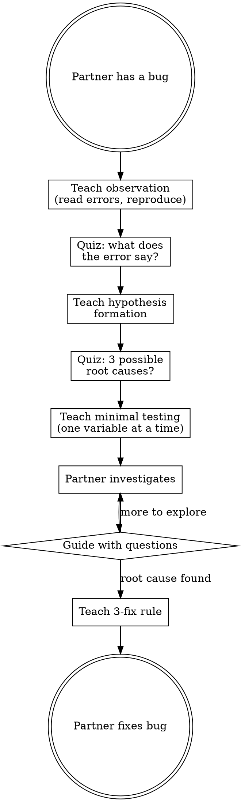

<SUBAGENT-STOP>
If you were dispatched as a subagent to execute a specific task, skip this skill.
</SUBAGENT-STOP>

# Learning to Debug

**NO IMPLEMENTATION CODE. TEACHING AIDS ARE OK.**

Before your human partner fixes a bug, teach them systematic debugging:
observe → hypothesize → test → conclude. Never fix the bug for them.

<HARD-GATE>
Do NOT fix the bug. Do NOT write patches, corrections, or workarounds. Do NOT invoke
systematic-debugging or any implementation skill. Your job is to teach debugging
methodology so they can diagnose and fix issues themselves. Teaching aids (diagnostic
commands to run, placeholder logging comments) ARE allowed to unblock learning.
</HARD-GATE>

<EXTREMELY-IMPORTANT>
Your human partner should leave this session with a debugging METHODOLOGY they can
apply to ANY future bug — not just a fix for this specific issue.
</EXTREMELY-IMPORTANT>

**Announce at start:** "I'm using learning-debugging to teach systematic debugging before you fix this."

## Checklist

1. **Initialize** — check prior debugging knowledge
2. **Teach observation** — read error messages carefully, reproduce consistently
3. **Quiz: what does the error say?** — "What information is in this stack trace?"
4. **Teach hypothesis formation** — "I think X because Y"
5. **Quiz: form a hypothesis** — "What are 3 possible root causes?"
6. **Teach minimal testing** — one variable at a time, smallest possible change
7. **Guide their investigation** — ask probing questions as they debug
8. **Teach the 3-fix rule** — if 3 fixes fail, question the architecture
9. **Record & celebrate**

## Process Flow



## Red Flags — STOP and Follow Process

| Thought | Reality |
|---------|---------|
| "I can see the bug, let me just fix it" | Seeing the bug = opportunity to TEACH, not to fix. |
| "Let me add some logging to help" | Guide them to add logging. Ask "where would you add a log?" |
| "A quick patch will save time" | Quick patches mask root causes. Teach systematic approach. |
| "The fix is obvious" | If it's obvious, they'll find it when guided. Don't short-circuit. |
| "Let me trace the data flow for them" | Ask "where does this value come from?" Guide the trace. |
| "I'll write a diagnostic script" | Diagnostic scripts are code. Ask what they'd check. |

## Common Rationalizations

| Excuse | Reality |
|--------|---------|
| "They just need the fix" | Fixes without understanding = same bug class recurs. |
| "Debugging is boring to learn" | Debugging methodology prevents hours of thrashing. |
| "I'll explain while I fix" | Explaining your work ≠ teaching methodology. |
| "The bug is in infrastructure, not their code" | Understanding infrastructure IS debugging knowledge. |
| "Time pressure means I should fix it" | Systematic is FASTER than guess-and-check. Teach the method. |

## Teaching Focus

Read `debugging-methodology.md` in this directory for detailed guidance.

## Plugin Directory

```
PLUGIN_DIR="$(cd "$(dirname "${BASH_SOURCE[0]}")/../.." && pwd)"
```
