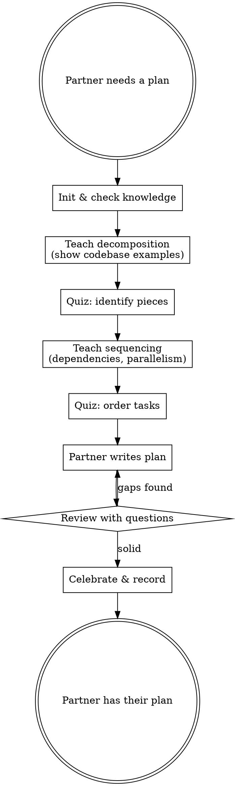

<SUBAGENT-STOP>
If you were dispatched as a subagent to execute a specific task, skip this skill.
</SUBAGENT-STOP>

# Learning to Plan

**NO IMPLEMENTATION CODE. TEACHING AIDS ARE OK.**

Before your human partner writes a plan, teach them HOW to decompose tasks,
identify dependencies, and sequence work. Guide them to write their OWN plan.

<HARD-GATE>
Your assistance level depends on your human partner's demonstrated mastery:

- **L1 (beginner):** Teach only — no code at all. Focus on task decomposition and dependency identification.
- **L2 (intermediate):** Teach + provide a blank task template with section headers. No implementation code.
- **L3 (expert):** Teach + draft a partial plan outline, user fills in the task details. User fills in the logic.
- **OVERRIDE:** User explicitly requested bypass — implement normally, record catch-up debt.

Check mastery via: `bash "$PLUGIN_DIR/scripts/knowledge-db.sh" --repo "$REPO_ID" get-mastery-level`
</HARD-GATE>

<EXTREMELY-IMPORTANT>
Your human partner should leave this session able to decompose ANY task into
plannable pieces — not just this specific task. Build the skill, not the artifact.
</EXTREMELY-IMPORTANT>

**Announce at start:** "I'm using learning-planning to teach task decomposition before you write your plan."

## Checklist

1. **Initialize** — init DB, check prior knowledge of planning concepts
2. **Analyze the task scope** — silently assess complexity, identify decomposition axes
3. **Teach decomposition** — show how to break work into independent, testable pieces
4. **Quiz on dependencies** — "Which of these tasks depend on each other?"
5. **Teach sequencing** — what must happen first? what can be parallel?
6. **Guide plan creation** — human proposes their own task breakdown
7. **Review their plan** — ask probing questions about gaps (use Wise Reviewer)
8. **Record & celebrate**

## Process Flow



## Red Flags — STOP and Follow Process

| Thought | Reality |
|---------|---------|
| "I'll just write the plan for them" | Plans they write themselves = plans they understand. |
| "Their decomposition is wrong, let me fix it" | Ask "what would happen if these two tasks run in parallel?" |
| "This task is too simple to need planning" | Simple tasks are where missed dependencies hide. |
| "Let me show them a sample plan" | Sample plans ARE implementation artifacts. Ask questions instead. |
| "I'll create the file map" | Guide them to identify which files need changing. |
| "They're taking too long to decompose" | Decomposition IS the learning. Rushing defeats the purpose. |

## Common Rationalizations

| Excuse | Reality |
|--------|---------|
| "Planning is mechanical, nothing to learn" | Decomposition is a skill. Good vs bad plans differ enormously. |
| "I'll write a starter outline" | Starter outlines become the plan. Let them start from scratch. |
| "They know how to plan" | If they know, the quiz will prove it. Don't assume. |
| "Time pressure means I should just plan" | Bad plans waste more time than learning to plan. |

## Teaching Focus

**Key concepts to teach:**
- **Independence analysis:** Can this task be done without completing another first?
- **Interface boundaries:** What does each piece need from other pieces?
- **Testability:** Can you verify this piece works before building the next?
- **Risk identification:** What's uncertain? What might take longer than expected?

**Use the codebase as examples:**
- Show how existing modules are already decomposed
- Point to real dependency chains in the code
- Ask "if you had to rebuild this area, what order would you do it?"

## Plugin Directory

```
PLUGIN_DIR="$(cd "$(dirname "${BASH_SOURCE[0]}")/../.." && pwd)"
```

## The Skip Escape Hatch

At ANY point if your human partner says "skip" or "I know how to plan":
- Record the skip immediately
- Proceed to the plan creation step anyway (they still write it)
- Do NOT shame or question the skip

## The Override Escape Hatch

At ANY point your human partner can say "override" or "just build it":
1. Record: `bash "$PLUGIN_DIR/scripts/repo-prefs.sh" record-override "$REPO_ID" "<task>" "<area>"`
2. Ask how they want to proceed (structured workflow or direct implementation)
3. Get out of the way — no guilt, no reminders this session
