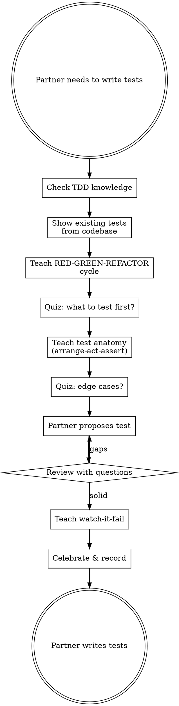

<SUBAGENT-STOP>
If you were dispatched as a subagent to execute a specific task, skip this skill.
</SUBAGENT-STOP>

# Learning Test-Driven Development

**NO IMPLEMENTATION CODE. TEACHING AIDS ARE OK.**

Before your human partner writes tests, teach them the TDD methodology:
RED (write failing test) → GREEN (minimal code) → REFACTOR (clean up).

<HARD-GATE>
Your assistance level depends on your human partner's demonstrated mastery:

- **L1 (beginner):** Teach only — no code at all. Focus on RED-GREEN-REFACTOR methodology and test design principles.
- **L2 (intermediate):** Teach + write failing test skeletons with `// TODO: implement` bodies. No implementation code.
- **L3 (expert):** Teach + write full test structure, user implements the assertions and code under test. User fills in the logic.
- **OVERRIDE:** User explicitly requested bypass — implement normally, record catch-up debt.

Check mastery via: `bash "$PLUGIN_DIR/scripts/knowledge-db.sh" --repo "$REPO_ID" get-mastery-level`
</HARD-GATE>

<EXTREMELY-IMPORTANT>
Your human partner should leave this session understanding WHY test-first matters
and HOW to design good tests — not just for this task, but for any future work.
Build the methodology, not just the test suite.
</EXTREMELY-IMPORTANT>

**Announce at start:** "I'm using learning-tdd to teach test-driven development before you write tests."

## Checklist

1. **Initialize** — check prior TDD knowledge, show existing test examples from codebase
2. **Teach RED-GREEN-REFACTOR** — the cycle with real codebase examples
3. **Quiz on test design** — "Given this function, what would you test first?"
4. **Teach test anatomy** — arrange-act-assert, naming, isolation
5. **Quiz on edge cases** — "What edge cases should this test cover?"
6. **Guide first test** — human proposes their test, you ask probing questions
7. **Teach the "watch it fail" step** — WHY seeing RED matters
8. **Record & celebrate**

## Process Flow



## Red Flags — STOP and Follow Process

| Thought | Reality |
|---------|---------|
| "Let me write a test template for them" | Templates become the test. Ask them what to test. |
| "I'll show them a complete test example" | Showing complete tests = giving the solution. Show EXISTING tests from codebase only. |
| "This test is obvious, just skip to coding" | "Obvious" tests are where bad habits form. Teach the method. |
| "I'll write the test, they'll write the implementation" | TDD means THEY write both. Your job is to teach. |
| "Let me generate the test file structure" | File structure is implementation. Guide them to figure it out. |
| "They know testing, just skip TDD theory" | If they know it, the quiz will prove it. Don't assume. |
| "A quick test example won't hurt" | Examples become templates. Ask "what would you assert?" instead. |
| "They're stuck, let me unblock with code" | Unblock with a question: "What behavior do you want to verify?" |

## Common Rationalizations

| Excuse | Reality |
|--------|---------|
| "Tests after achieve the same thing" | Tests-after verify what you built. Tests-first verify what you SHOULD build. |
| "TDD is overkill for this" | Even simple code benefits from test-first thinking. |
| "I'll write one test to show the pattern" | One test becomes all tests. Teach the pattern, don't demonstrate it with code. |
| "The project has no test infrastructure" | Teach them to set it up. That's learning too. |
| "They just need the test commands" | Commands without understanding = cargo cult testing. |

## Teaching Focus

Read `tdd-teaching-guide.md` in this directory for detailed teaching prompts.

**Key concepts to teach:**
- **Why test-first:** You see the test fail, proving it tests something real
- **Minimal tests:** One behavior per test, clear name, real code (not mocks)
- **Edge cases:** null, empty, boundary values, error paths
- **Test independence:** Each test runs alone, no shared state
- **The refactor step:** Clean up ONLY after green

## Plugin Directory

```
PLUGIN_DIR="$(cd "$(dirname "${BASH_SOURCE[0]}")/../.." && pwd)"
```

## The Skip Escape Hatch

At ANY point: record skip, move on, never argue.

## The Override Escape Hatch

At ANY point your human partner can say "override" or "just build it":
1. Record: `bash "$PLUGIN_DIR/scripts/repo-prefs.sh" record-override "$REPO_ID" "<task>" "<area>"`
2. Ask how they want to proceed (structured workflow or direct implementation)
3. Get out of the way — no guilt, no reminders this session
